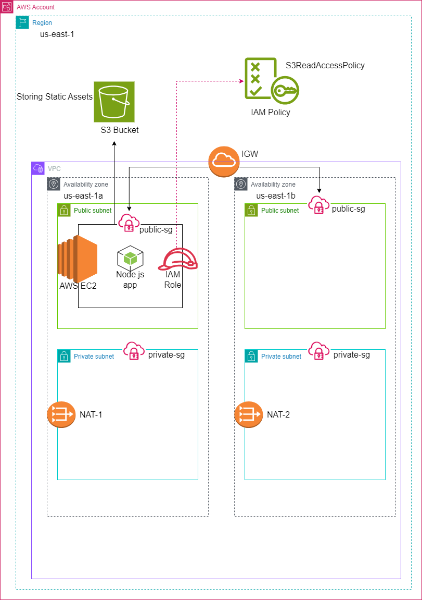

**Hospital Chatbot AWS Infrastructure -Terraform Deployment Guide**

Design AWS infrastructure for a hospital AI chatbot frontend using
Terraform

**Overview**

The setup covers:

-   VPC with public and private subnets (in two Availability Zones)

-   Internet Gateway & NAT Gateways

-   Route Tables for traffic control

-   Security Groups for both public and private instances

-   IAM Role and Instance Profile for S3 access

-   S3 Bucket for chatbot assets

-   EC2 instance(s) with Amazon Linux 2023 & Node.js

-   Automated application deployment using a chatbot.sh script

**Architecture**

{width="6.9625in" height="4.110770997375328in"}

**Prerequisites**

-   Terraform version \>= v5.0

-   AWS CLI configured (aws configure)

-   SSH Key Pair created (key_name = \"demo\") in the AWS EC2 dashboard.

**Deployment Steps**

**1️ Clone the Repository**

git clone https://github.com/your-repo/hospital-chatbot-infra.git

cd hospital-chatbot-infra

**2️ Initialize Terraform**

\# terraform init

**3️ Validate Configuration**

\# terraform validate

**4️ Plan the Deployment**

\# terraform plan

Review the output carefully.

**5️ Apply the Deployment**

\# terraform apply

**6️ Post Deployment**

-   The EC2 instances will automatically:

    -   Update via yum update

    -   Install Node.js and Git

    -   Clone the chatbot app from GitHub

    -   Start both frontend and backend using npm start as defined in
        chatbot.sh.

Application will be live on the public EC2 instance in Public Subnet 1.

**S3 Bucket**

An S3 bucket will be created:

Name: hospital-chatbot-assets

This bucket is versioned and private, intended for your AI chatbot's
static assets.

**Security**

-   **Public EC2 Security Group**: allows SSH (22), HTTP (80), and
    custom TCP port (3000) from anywhere.

-   **Private EC2 Security Group**: allows MySQL (3306) inbound only
    from instances in the public security group.

**Terraform Files Structure**

  -----------------------------------------------------------------------
  **FILE**                            **Purpose**
  ----------------------------------- -----------------------------------
  provider.tf                         AWS Provider configuration

  vpc.tf                              VPC, Subnets, IGW, NAT, Route
                                      Tables

  variable.tf                         All configurable input variables

  ec2.tf                              EC2 instances and user data script

  iam.tf                              IAM Role, Policy, Instance Profile

  s3.tf                               S3 bucket for assets

  chatbot.sh                          Bootstrap script for server
                                      initialization
  -----------------------------------------------------------------------

  ---------------- ------------------------------------------------------
                   

                   
  ---------------- ------------------------------------------------------

**Cleanup**

When you\'re done:

\# terraform destroy

This will delete all created resources, including the S3 bucket.

**Notes**

-   NAT Gateways are placed in public subnets for private subnet
    instances to reach the internet.

-   chatbot.sh clones the
    [[tyleroneil72/chat-bot]{.underline}](https://github.com/tyleroneil72/chat-bot)
    repo and launches the frontend and backend.

-   Make sure key_name is set to an existing EC2 keypair for SSH access.
